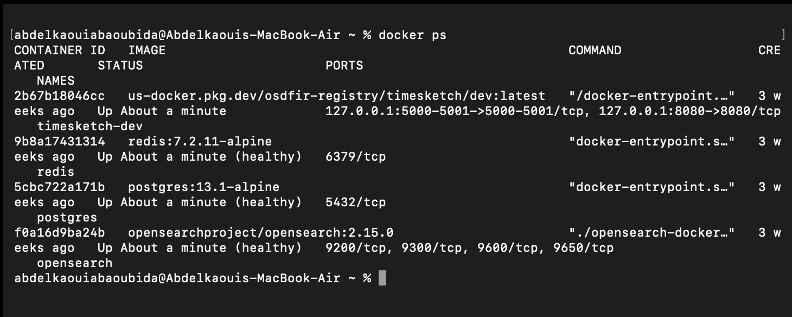
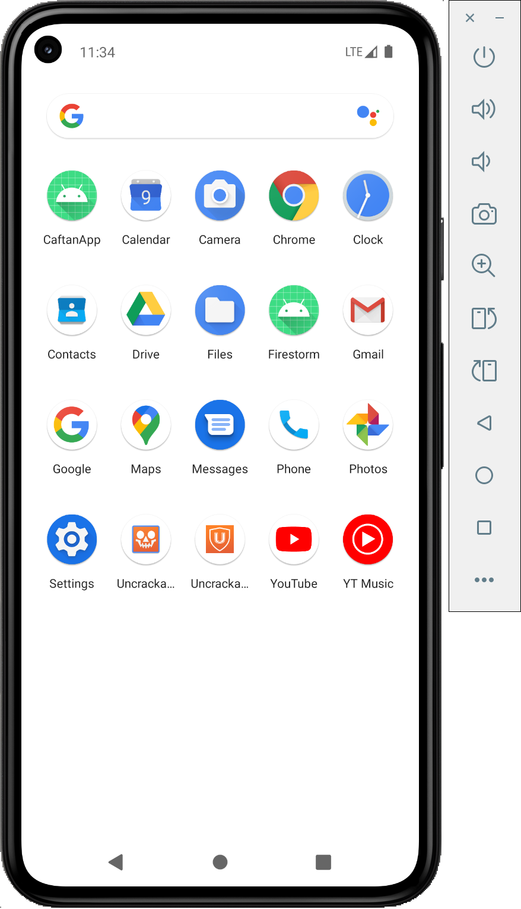
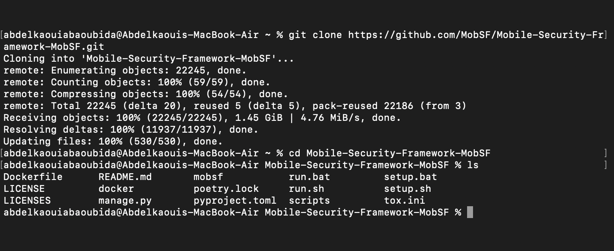
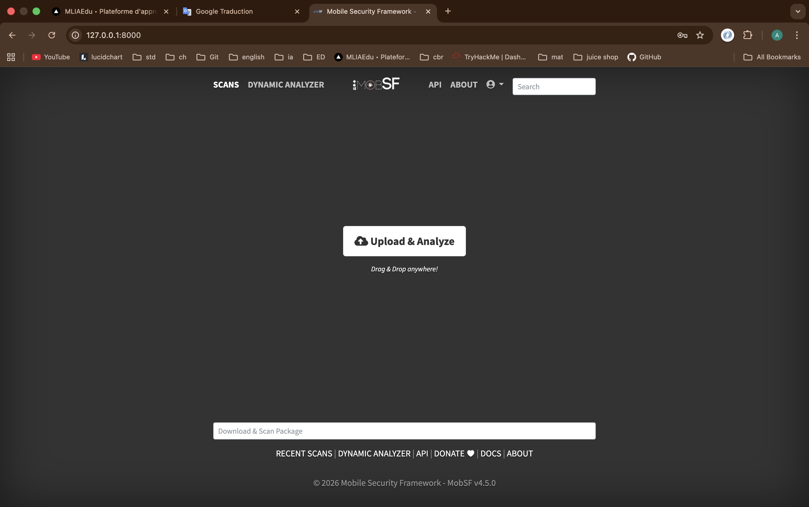
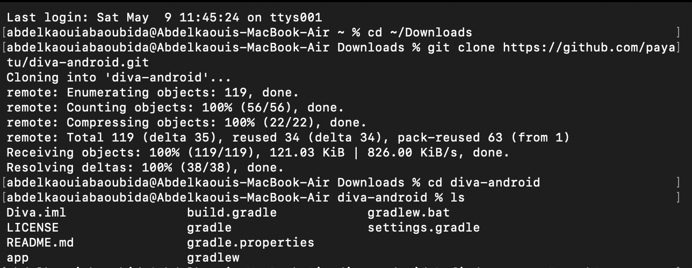
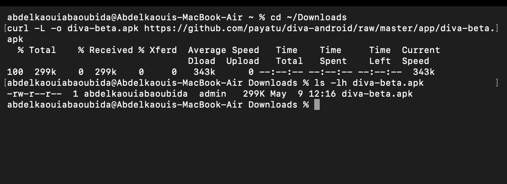
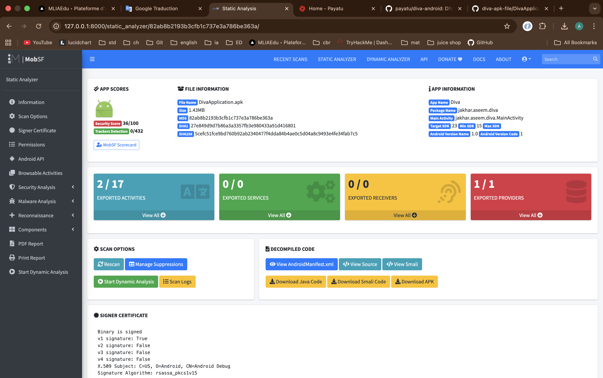
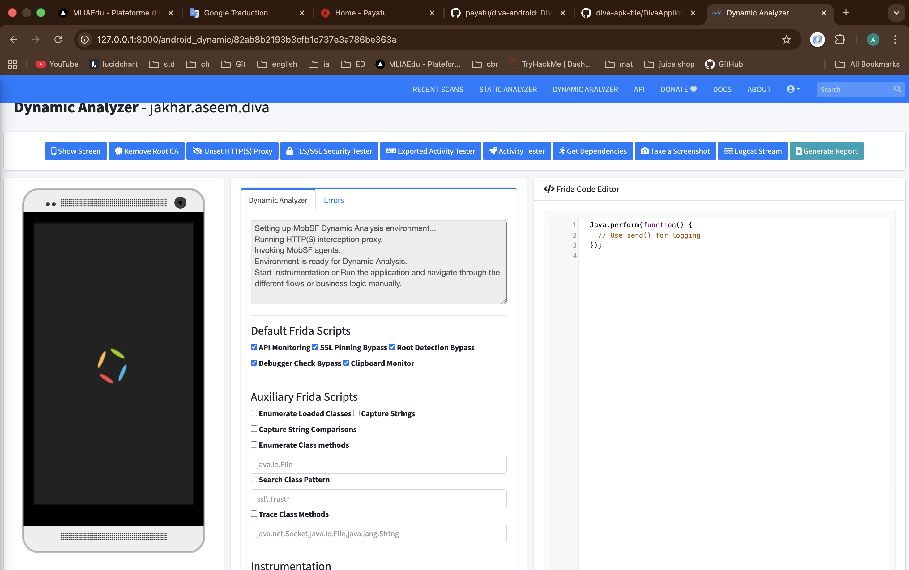
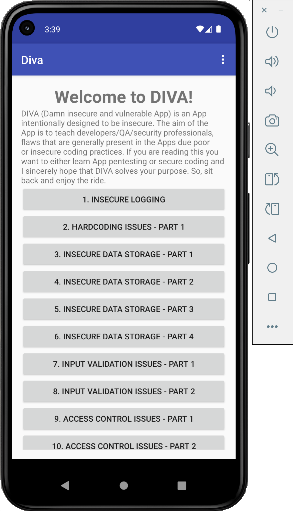

# Lab MobSF — Analyse Statique et Dynamique de DIVA

## Introduction

Ce laboratoire présente la mise en place d’un environnement complet d’analyse de sécurité Android avec MobSF (Mobile Security Framework) et l’application vulnérable DIVA.

L’objectif est de :

* Configurer MobSF avec Docker
* Préparer l’émulateur Android
* Télécharger et analyser l’APK DIVA
* Réaliser une analyse statique
* Réaliser une analyse dynamique
* Utiliser Frida et les fonctionnalités de monitoring MobSF

---

# Capture 1 — Vérification des conteneurs Docker



Cette capture montre la commande :

```bash
docker ps
```

Elle permet de vérifier les conteneurs Docker actifs sur la machine.

On observe plusieurs services :

* Timesketch
* Redis
* PostgreSQL
* OpenSearch

Cette étape confirme que l’environnement Docker fonctionne correctement.

---

# Capture 2 — Émulateur Android lancé



Cette capture montre l’émulateur Android démarré avec succès.

L’émulateur représente l’environnement cible utilisé par MobSF pour effectuer l’analyse dynamique des applications Android.

Il servira à :

* Installer les APK
* Observer le comportement des applications
* Réaliser l’instrumentation dynamique

---

# Capture 3 — Clonage du dépôt MobSF



Dans cette étape, le dépôt officiel MobSF est cloné depuis GitHub.

Commande utilisée :

```bash
git clone https://github.com/MobSF/Mobile-Security-Framework-MobSF.git
```

Ensuite, le contenu du projet est affiché avec :

```bash
ls
```

Cette étape permet de récupérer les scripts et fichiers nécessaires au framework MobSF.

---

# Capture 4 — Interface principale MobSF



Cette capture montre l’interface web principale de MobSF.

MobSF est accessible depuis le navigateur à l’adresse :

```bash
http://127.0.0.1:8000
```

L’interface permet :

* d’importer des APK,
* de lancer les analyses,
* d’accéder aux rapports,
* d’utiliser les outils dynamiques.

---

# Capture 5 — Téléchargement du projet DIVA



Cette étape montre le clonage du dépôt GitHub de DIVA.

Commande utilisée :

```bash
git clone https://github.com/payatu/diva-android.git
```

Le projet DIVA contient plusieurs vulnérabilités Android intentionnelles destinées à l’apprentissage du pentest mobile.

---

# Capture 6 — Téléchargement de l’APK DIVA



Dans cette étape, l’APK DIVA est téléchargée directement depuis GitHub.

Commande utilisée :

```bash
curl -L -o diva-beta.apk https://github.com/payatu/diva-android/raw/master/app/diva-beta.apk
```

Puis une vérification est réalisée avec :

```bash
ls -lh diva-beta.apk
```

Cette étape confirme que l’APK a bien été téléchargée.

---

# Capture 7 — Résultat de l’Analyse Statique



Cette capture montre le tableau de bord de l’analyse statique réalisée par MobSF.

Les informations affichées incluent :

* Le score de sécurité
* Les activités exportées
* Les providers exportés
* Les informations de signature
* Les informations AndroidManifest.xml

MobSF effectue automatiquement le décompilage et l’analyse de sécurité de l’application.

---

# Capture 8 — Interface Dynamic Analyzer



Cette capture montre l’environnement d’analyse dynamique de MobSF.

On peut observer :

* L’écran de l’émulateur
* Les scripts Frida
* Les outils de monitoring
* Les options d’instrumentation
* Les outils TLS/SSL
* Les logs Android

MobSF prépare automatiquement :

* le proxy HTTP/HTTPS,
* l’instrumentation Frida,
* les agents d’analyse.

---

# Capture 9 — Application DIVA exécutée



Cette capture montre l’application DIVA lancée dans l’émulateur Android.

L’application contient plusieurs sections vulnérables :

* Insecure Logging
* Hardcoding Issues
* Insecure Data Storage
* Input Validation Issues
* Access Control Issues

Ces modules permettent de tester différentes vulnérabilités Android dans un environnement contrôlé.

---

# Conclusion

Ce laboratoire a permis de mettre en place un environnement complet d’analyse de sécurité Android.

Les principales étapes réalisées sont :

* Installation et lancement de MobSF
* Préparation de l’émulateur Android
* Téléchargement de DIVA
* Analyse statique de l’APK
* Analyse dynamique avec Frida
* Observation des vulnérabilités Android

MobSF constitue une plateforme très puissante pour les audits de sécurité mobile et l’apprentissage du pentest Android.

---

# Outils Utilisés

* MobSF
* Docker
* Android Emulator
* Frida
* Git
* DIVA AP
